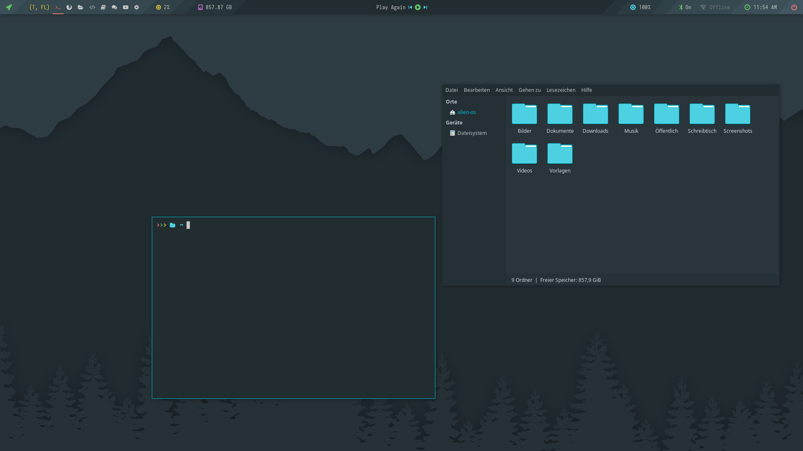
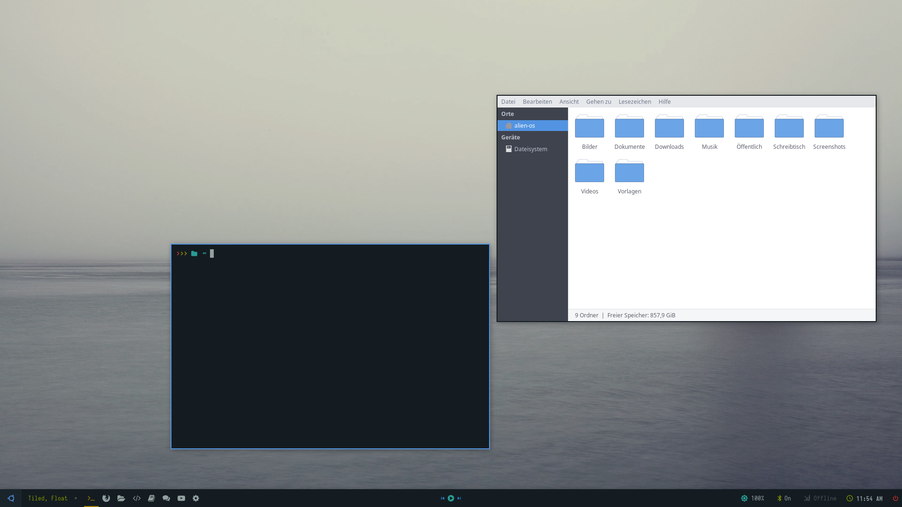
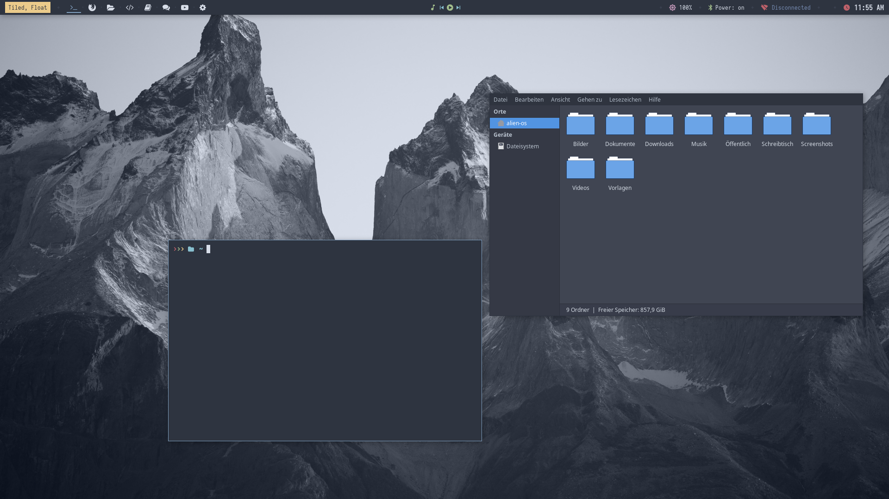
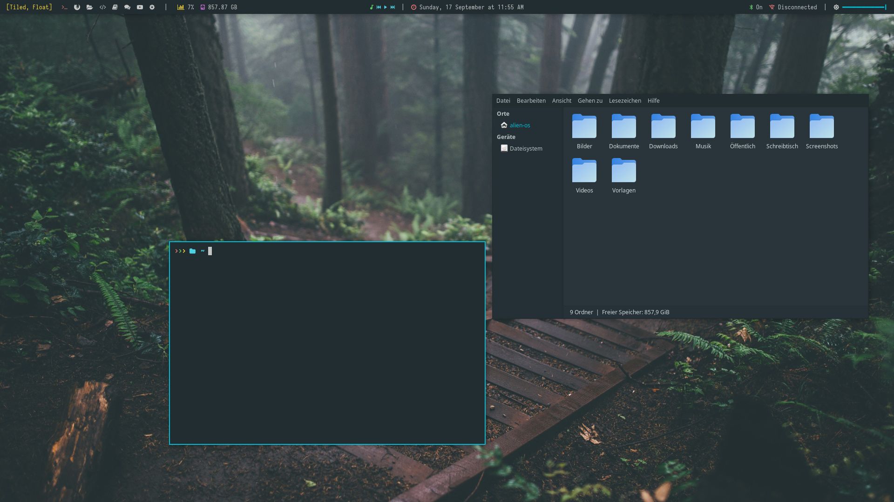
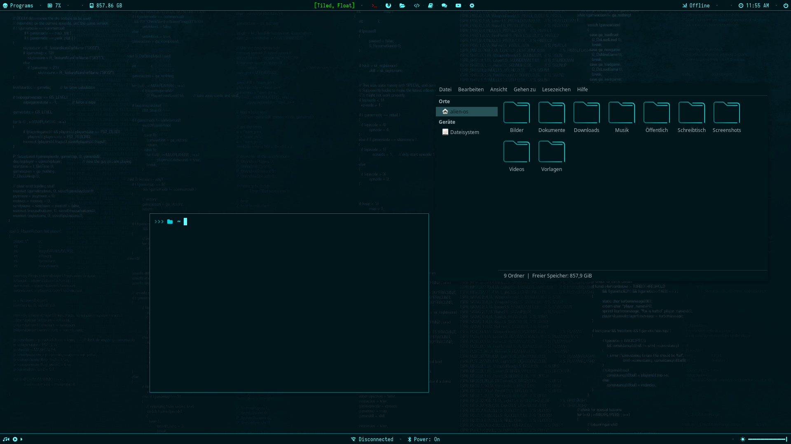
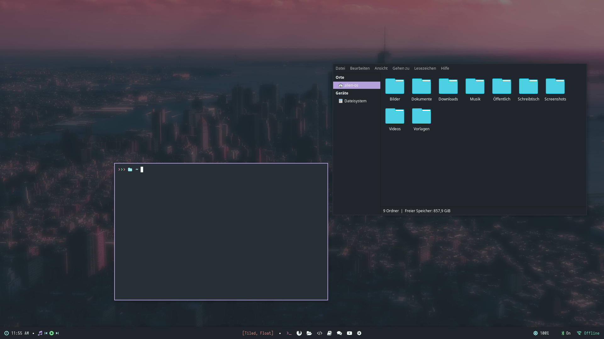
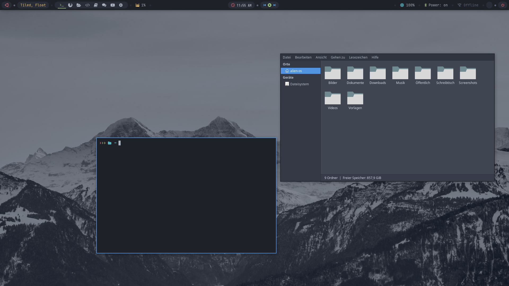
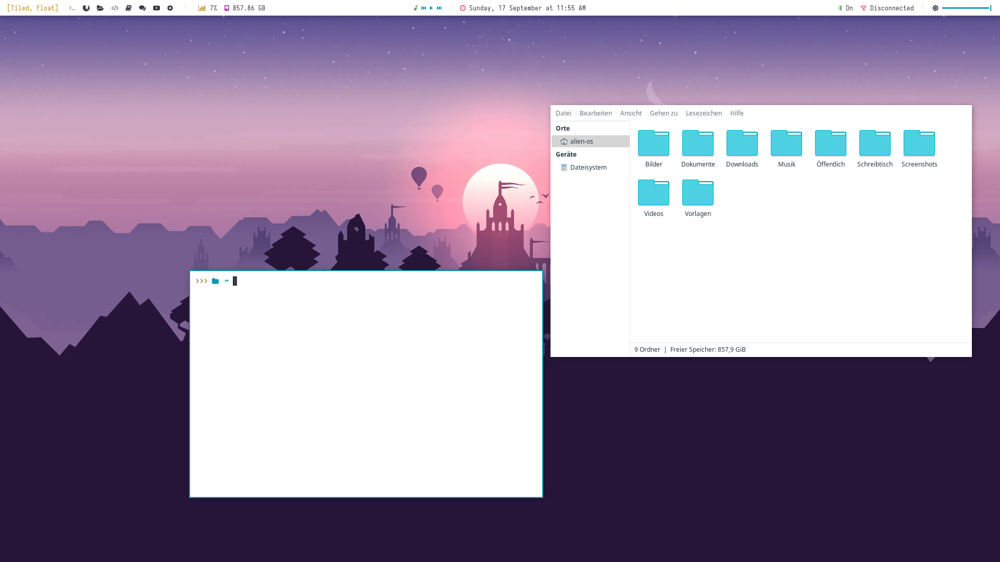
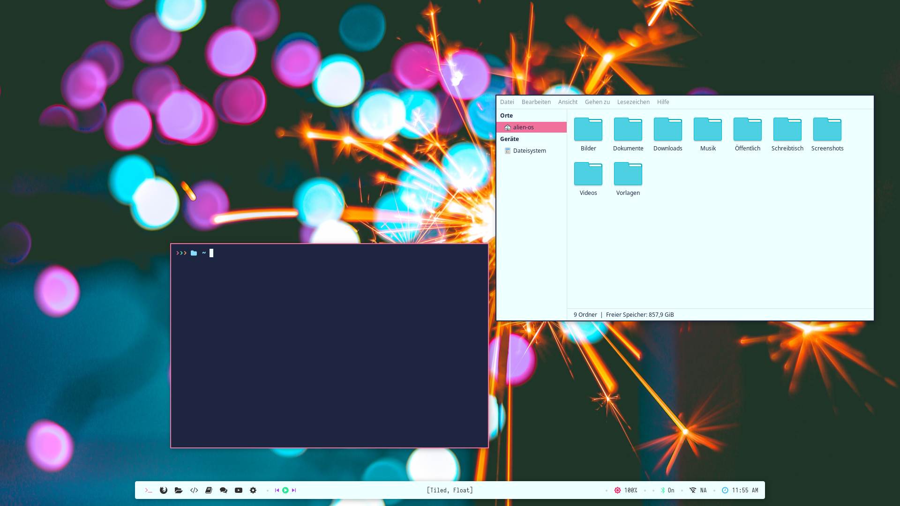

# Alien-OS DebianCraft

### BSPWM Setup
#### for Alien-OS / MX-Linux 23 / Debian 12
##### inspired by Archcraft

---

Get the .iso-image at:
https://sourceforge.net/projects/alien-os-nano/files/

Alien-OS DebianCraft

is a minimal distro based on Debian 12.1 with Linux Kernel 6.4
and the Archcraft look and feel - just without Arch. ;-)

10 preinstalled BSPWM themes!
Firefox, Alacritty, Oh-My-Zsh, Synaptic, Thunar, Geany and the MX-Tools are preinstalled and that's basically it.
A perfect base for your own project!

This was done just for testing purposes and will not be continued!

Login: demo
Pass: demo

Install: ’sudo minstall’

---

